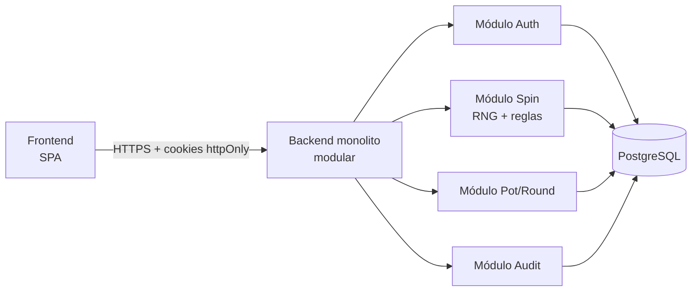
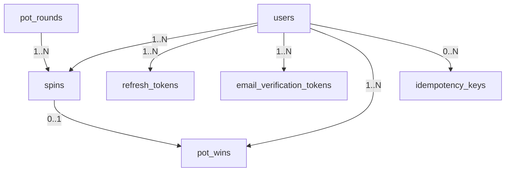

# Especificación Técnica — Ruleta con Pozo Acumulado (V0.2.1)

2026-09-16 · @Someone

Juego de casino virtual (sin dinero real en esta etapa): pozo compartido, un giro diario por jugador, espacio dorado de baja probabilidad. Esta es la especificación técnica antes de escribir código, iterada a través de varias rondas de auditoría de DeepSeek.

## A. Análisis del concepto del juego

Es un juego de azar de **pozo progresivo compartido**, estructuralmente igual a una lotería/jackpot de casino real, salvo que aquí el premio es virtual. Elementos centrales:

- **Pozo único global, organizado en rondas**: todos los jugadores contribuyen y compiten por el premio de la **ronda activa** (ver C3 en la sección L); al ganar, la ronda se cierra y se abre una nueva.
- **Cadencia limitada**: un giro por jugador por día crea presión de "regreso diario" (mecánica tipo *daily login/streak*), buena para retención pero exige un control de tiempo robusto contra manipulación.
- **Probabilidad baja y fija (o casi fija)**: el espacio dorado pequeño implica una probabilidad de victoria muy baja; el pozo crece porque la mayoría de los giros no ganan. Valor exacto: p = 1/100.000, fija e independiente del pozo — **cerrado (J.1–J.3 en L.7)**.
- **Naturaleza del premio**: al no haber dinero real, el juego se clasifica como entretenimiento/gamificación, no como apuesta regulada — pero la arquitectura de integridad (RNG, transacciones, auditoría) se construye como si ya lo fuera, por si evoluciona a dinero real más adelante.
- **Economía del pozo**: el monto de contribución por giro fallido es `1` unidad virtual fija, `0` en giros ganadores — **cerrado (J.2, ver L.7)**; el modelo (E) ya soporta cualquiera de las variantes vía `contribution_amount` por giro.

En patrón de juego, se parece más a una **rifa acumulativa diaria por rondas** que a una ruleta clásica de números — el giro es sobre todo una animación/interfaz sobre un evento binario (dorado / no dorado).

## B. Reglas ambiguas o pendientes de definir

Estado de cada ambigüedad de la V0.1, tras la auditoría (detalle de cada resolución en la sección L):

1. **Qué pasa tras ganar** — **cerrado (J.1)**: el pozo se reinicia a `pot_minimum = 100`; el ganador no puede volver a girar ese mismo día.
2. **Contribución al pozo** — **cerrado (J.2)**: `contribution_amount = 1` fijo por giro no ganador, `0` en giros ganadores.
3. **Probabilidad del espacio dorado** — **cerrado (J.3)**: `p = 1/100.000`, fija, pública (ver `GET /api/game-info` en F).
4. **Definición de "día"** — **resuelto**: `game_day` se calcula siempre en UTC, en el servidor (ver C).
5. **Cuentas múltiples** — **diferido a V0.2, no bloqueante**: fuera de alcance de la versión actual; se registran IP y huella de dispositivo por giro (ver H5) para permitir detección posterior, sin bloquear giros.
6. **Elegibilidad para girar** — **diferido a V0.2, no bloqueante**: en la versión actual solo se exige cuenta con email verificado (ver M3); no hay requisitos de antigüedad.
7. **Límite máximo del pozo** — **diferido a V0.2, no bloqueante**: no hay tope en la versión actual.
8. **Empates o giros simultáneos** — **resuelto**: `UNIQUE(winner_spin_id)` en `pot_rounds` garantiza un único ganador por ronda a nivel de base de datos (ver E, C3 en L.1).
9. **Historial visible** — **resuelto**: el pozo actual y el historial de ganadores son públicos, sin autenticación (ver M5 en L.2).
10. **Penalizaciones por manipulación** — **diferido a V0.2, no bloqueante**: en la versión actual el sistema solo rechaza el giro extra (`409`/`idempotentReplay`); no hay sanción de cuenta.

Los ítems 5, 6, 7 y 10 quedan fuera de alcance de la versión actual por decisión explícita (no son bloqueantes para iniciar V0.2, pero deben decidirse antes de V1.0).

## C. Propuesta de arquitectura inicial

Principio rector: **el backend es la única autoridad**; el frontend nunca calcula ni decide resultados, solo los anima.

**Decisión de arquitectura (resuelve M4 de V0.1.1)**: **monolito modular**, un único proceso/despliegue escalable horizontalmente detrás de un balanceador, con módulos internos separados por responsabilidad (`auth`, `spin`, `pot`, `audit`) que comparten una única base PostgreSQL. Se descarta microservicios: la lógica de giro/pozo/ronda requiere una transacción atómica multi-tabla que es simple dentro de un monolito y costosa como transacción distribuida.



- **Frontend**: SPA que solo consume la API vía cookies de sesión; muestra saldo del pozo, anima el giro con el resultado que YA devolvió el backend.
- **Backend**: expone la API REST, valida el límite diario, ejecuta el RNG, actualiza el pozo/ronda y persiste todo dentro de una única transacción atómica por giro.
- **Autenticación y sesión (resuelve C2 de V0.1.1)**: `accessToken` (JWT, TTL 15 min) y `refreshToken` (opaco, TTL 30 días) como cookies `httpOnly`, `Secure`, `SameSite=Strict`; el `refreshToken` restringido a `Path=/api/auth/refresh`. Las mutaciones sobre sesión establecida exigen `X-CSRF-Token` (double-submit contra la cookie `csrfToken`, ver F para las excepciones). El `csrfToken` se reemite junto con `accessToken`/`refreshToken` en cada `POST /api/auth/refresh`, para mantenerse sincronizado con la sesión vigente.
- **Concurrencia (resuelve H4 de V0.1.1)**: **SERIALIZABLE** con reintento exponencial en la transacción de giro (máx. 3 intentos; backoff 50 ms · 2^intento + jitter 0–20 ms); un `40001 serialization_failure` dispara un reintento; agotados los 3, `503 retry_later` (ver F, M4).
- **Momento del sorteo del RNG (resuelve A2)**: el valor `rng_raw_output` se dibuja **una única vez, fuera de la transacción SERIALIZABLE**, antes del primer intento. Los reintentos por `40001` repiten solo la transacción (inserción de `spins`, actualización de `pot_rounds`/pozo); el valor del RNG y el `result` ya derivado de él permanecen fijos entre reintentos. Se descarta dibujar el RNG dentro de la transacción porque un reintento generaría un segundo valor y podría convertir un giro originalmente `gold` en `no_gold` (o viceversa), rompiendo la trazabilidad de "la primera decisión del RNG" que exige la auditoría. Si los 3 reintentos se agotan (`503`), no se persiste nada — ni el spin ni el draw quedan registrados — y una solicitud posterior del cliente, incluso con el mismo `Idempotency-Key`, se trata como un intento nuevo con un nuevo dibujo de RNG (ver F, M1).
- **RNG**: generación criptográficamente segura (`crypto.randomInt` en Node o `secrets`/`os.urandom` en Python), ejecutada y sellada en el backend.
- **Base de datos**: relacional (ver D), con integridad transaccional fuerte.
- **Seguridad**: rate limiting por IP/usuario/cuenta (ver F), validación estricta de inputs, CORS restringido al origen del frontend, CSRF vía double-submit (con las excepciones documentadas en F, M3), logs de auditoría con mecanismo de solo-inserción real (ver Observabilidad, abajo).

### Middleware de autenticación (resuelve N1, N10, N12, N14, N15)

Orden exacto de validación en el middleware para un endpoint autenticado genérico (resuelve N14):

1. **Rate limiting** (por IP y, si aplica, por usuario/cuenta autenticada — ver F para los límites de cada endpoint).
2. **CSRF** (`X-CSRF-Token`, solo en los endpoints de mutación que lo exigen; ver F para las excepciones de login/register/verify).
3. **Firma del JWT**: contra `JWT_SECRET`, y si falla, contra `JWT_SECRET_PREVIOUS` dentro de la ventana de rotación (≤90 días, ver D/N).
4. **Estado de cuenta**: `locked_until` no en el futuro y `email_verified_at` no nulo (con la excepción de `POST /api/auth/logout`, ver abajo, resuelve N15).
5. **Rol**, solo en los endpoints que lo exigen (p. ej. `GET /api/admin/...`).
6. **Handler del endpoint**.

Este orden importa: el rate limiting va primero para que un atacante no pueda agotar los cubos de límite forzando primero la autenticación; el CSRF va antes de validar la firma del JWT para no darle a un atacante sin `csrfToken` válido información sobre si su JWT robado o falsificado es o no válido; el estado de cuenta y el rol se validan después de que la firma ya es de confianza, porque dependen de leer datos asociados a un `user_id` que solo es fiable una vez verificada la firma.

**`POST /api/auth/refresh` (resuelve N12, N17)**: se autentica con el `refreshToken`, no con el `accessToken`, así que no pasa por los pasos 3–5 de arriba tal cual, pero aplica dos validaciones propias, en este orden:

1. **Estado de cuenta (N12)**: `locked_until`/`email_verified_at` de la cuenta asociada al `refreshToken`. Si la cuenta está bloqueada o no verificada, `423`/`403` — y el endpoint se detiene aquí, sin evaluar reutilización.
2. **Reutilización del token (N2)**: solo si la cuenta está en buen estado, se revisa si el `token_hash` corresponde a una fila con `revoked_at` no nulo; si es así, `401` + revocación de toda la familia de refresh tokens de ese `user_id` + log `result="refresh_reuse_detected"`.

**Orden decidido (resuelve N17)**: estado de cuenta primero. Una cuenta bloqueada no debe disparar la lógica de revocación de familia —que tiene efectos laterales, invalida todas las sesiones activas del usuario— solo porque, además, coincida con presentar un token ya rotado; el bloqueo por sí solo ya es motivo suficiente para detener el flujo, y evaluarlo antes evita ese efecto lateral innecesario. **Caso límite**: una cuenta bloqueada que además presenta un refresh token ya revocado responde `423 account_locked` (no `401`), sin revocar la familia.

**`POST /api/auth/logout` (resuelve N15)**: exento del paso 4 (estado de cuenta) — una cuenta bloqueada o no verificada puede seguir cerrando sesión y limpiando sus cookies; esto no otorga ningún privilegio (logout no expone datos ni realiza acciones de negocio) y evita que un usuario bloqueado quede con cookies inválidas sin forma de limpiarlas hasta que expire el bloqueo. `logout` sigue exigiendo los pasos 1–3 (rate limiting, CSRF, firma válida del access token).

### Observabilidad (resuelve A3)

- **Formato**: JSON estructurado, una línea por evento (ndjson).
- **Campos mínimos obligatorios**: `timestamp` (ISO8601, UTC), `level`, `request_id`, `user_id` (nullable), `spin_id` (nullable), `route`, `method`, `status_code`, `latency_ms`, `result` (nullable).
- **Destino**: la aplicación escribe a `stdout`; el agente del orquestador de contenedores recolecta ese stream y lo envía a **Grafana Loki** (destino de referencia elegido para V0.1.x; cualquier colector compatible con logs JSON estructurados es intercambiable).
- **Retención**: logs operativos (los de arriba), **30 días** en el colector. La tabla de auditoría transaccional (`spins`, `pot_wins`, `pot_rounds`, `idempotency_keys`, ver E) es **indefinida** — nunca se borra (restricciones `ON DELETE RESTRICT`) — y es la fuente de verdad para disputas, distinta de los logs operativos.
- **PII en logs (resuelve N7)**: `user_id` se registra **tal cual, sin enmascarar ni hashear**, en V0.1.x. Decisión explícita, no implícita: se revisará antes de V1.0 si el marco legal aplicable al lanzamiento lo exige (p. ej. pseudonimización). La retención de 30 días (arriba) ya acota la ventana de exposición.

## D. Recomendación de stack tecnológico

| Capa | Opción recomendada | Por qué | Trade-offs |
| --- | --- | --- | --- |
| Frontend | React + TypeScript + Vite | Tipado fuerte reduce bugs en la lógica de presentación del pozo/giro; Vite acelera el ciclo de desarrollo; ecosistema maduro de testing (Vitest, Testing Library) | Curva de aprendizaje si el equipo no conoce TS; hay que resistir la tentación de meter lógica de negocio en el cliente |
| Backend | Node.js + TypeScript (Express o Fastify) **o** Python + FastAPI | Node/TS comparte lenguaje y tipos con el frontend (menor fricción, contratos compartibles); FastAPI destaca en validación de datos (Pydantic) y documentación OpenAPI automática, y su tipado facilita pruebas | Node: el ecosistema de concurrencia/transacciones exige disciplina explícita. FastAPI: dos lenguajes en el equipo (TS + Python) |
| Base de datos | PostgreSQL | Transacciones ACID robustas, aislamiento SERIALIZABLE nativo (ver C), ideal para el problema de concurrencia del giro diario y las rondas de pozo | Requiere modelar bien índices y aislamiento; no es "serverless" trivial |
| ORM/Query | Prisma (si Node) o SQLAlchemy (si Python) | Migraciones versionadas, tipado en las consultas | Prisma: menos control fino sobre SQL avanzado; puede requerir SQL crudo para índices únicos parciales |
| Autenticación | JWT de corta vida + refresh token opaco, hashing con Argon2id | Estándar, bien soportado en ambos stacks, revocable vía `refresh_tokens` (ver E) | Requiere manejar revocación/expiración con cuidado |
| Gestión de secretos (resuelve M6) | Variables de entorno inyectadas vía Docker secrets / secret store del proveedor de CI-CD, nunca committeadas (`.env` en `.gitignore`, `.env.example` versionado) | Evita fugas de credenciales en el repo; rotación de la clave de firma JWT cada ≤90 días con ventana de doble clave para validar tokens emitidos con la clave anterior | Requiere disciplina operativa de rotación; la rotación de la contraseña de la base de datos queda fuera de alcance de la app (proceso de infraestructura) |
| Infraestructura | Docker + docker-compose (dev/prod) | Reproducibilidad entre máquinas y CI, facilita levantar Postgres local igual en Windows | Overhead inicial de configuración |
| Testing | Vitest/Jest (unit), Supertest o httpx (integración), Playwright (E2E), k6 o similar (carga) | Cobertura de los niveles críticos: reglas de negocio, API, flujo completo de usuario, carga (resuelve B4) | Las pruebas de concurrencia (doble giro) requieren escenarios específicos, no solo unitarios |

**Recomendación**: **Node.js + TypeScript + Express/Fastify** en el backend, por compartir tipado con el frontend React/TS y simplificar contratos API compartidos — priorizando mantenibilidad sobre rendimiento bruto, que no es el cuello de botella aquí. FastAPI queda como alternativa sólida si el equipo prefiere la validación automática de Pydantic y ya tiene afinidad con Python.

## E. Modelo de datos preliminar



**users**

- `id` (PK, UUID)
- `email` (único, not null)
- `password_hash` (Argon2id)
- `role` (enum: `user` | `admin`, default `user`, not null — resuelve A1)
- `display_name` (nullable; si es nulo, la API pública lo muestra como `Jugador-<8 chars de id>`)
- `email_verified_at` (timestamptz, nullable)
- `failed_login_attempts` (int, default 0)
- `locked_until` (timestamptz, nullable)
- `created_at`
- índice único en `email`

**Asignación del primer admin (resuelve A1)**: no existe endpoint ni flujo de autopromoción a `admin` dentro de la aplicación. El primer usuario `admin` (y cualquier posterior) se crea mediante una actualización manual de `users.role` ejecutada por un operador durante el despliegue — paso del runbook operativo, fuera del código de la aplicación — nunca vía la API pública.

**Política de `display_name` (resuelve N6)**: aunque todavía no existe endpoint para fijarlo, la política queda definida por adelantado: longitud 2–32 caracteres; caracteres permitidos: alfanuméricos, guion, guion bajo y espacio (sin HTML ni markup). En toda respuesta pública que lo incluya (`GET /api/pot/winners`, ver F) el valor se escapa como HTML antes de devolverse, como defensa en profundidad aunque la validación de entrada ya lo restrinja.

**pot\_rounds**

- `id` (PK, UUID)
- `initial_amount` (numeric, not null; = `pot_minimum` — **cerrado (J.1)**: 100 unidades virtuales por defecto, configurable vía `POT_MINIMUM`, ver L.7)
- `started_at` (timestamptz, not null)
- `ended_at` (timestamptz, nullable)
- `final_amount` (numeric, nullable)
- `winner_user_id` (FK → users, nullable)
- `winner_spin_id` (FK → spins, nullable, **UNIQUE**)
- índice único parcial: `CREATE UNIQUE INDEX one_open_round ON pot_rounds ((true)) WHERE ended_at IS NULL`

**spins** (registro histórico, append-only)

- `id` (PK, UUID)
- `user_id` (FK → users, not null)
- `round_id` (FK → pot\_rounds, not null)
- `game_day` (DATE, calculado en UTC en el servidor)
- `result` (enum: `gold` | `no_gold`)
- `rng_algorithm` (text, not null)
- `rng_raw_output` (bigint, not null)
- `rng_threshold` (bigint, not null)
- `rng_drawn_at` (timestamptz, not null — instante del **único** dibujo del RNG para este giro, ver C; resuelve A2, no el instante del commit)
- `pot_before`, `pot_after` (numeric; semántica exacta en F, A4)
- `contribution_amount` (numeric; = `CONTRIBUTION_AMOUNT` = 1 en giros no ganadores, 0 en giros ganadores — **cerrado (J.2)**, ver L.7)
- `created_at`
- **restricción única compuesta**: `UNIQUE(user_id, game_day)`
- índices: `(user_id, game_day)`, `created_at`, `round_id`

**pot\_wins**

- `id` (PK, UUID)
- `spin_id` (FK → spins, único)
- `user_id` (FK → users)
- `amount_won` (numeric)
- `won_at` (timestamptz)
- índice en `won_at`

**idempotency\_keys**

- `id` (PK, UUID)
- `user_id` (FK → users, not null)
- `key` (text, not null)
- `spin_id` (FK → spins, not null)
- `created_at`
- **restricción única**: `UNIQUE(user_id, key)`
- La fila se inserta en la **misma transacción** que el `spin` (ver F, resuelve M1): si la transacción falla y hace rollback, ni el spin ni la clave quedan persistidos

**refresh\_tokens**

- `id` (PK, UUID)
- `user_id` (FK → users, not null)
- `token_hash` (text, not null — SHA-256 del refresh token concatenado con un pepper de aplicación `REFRESH_TOKEN_PEPPER` (ver N); resuelve B2. Se usa SHA-256 y no Argon2id/bcrypt porque el refresh token es un valor aleatorio de alta entropía generado por el servidor, no un secreto de baja entropía elegido por una persona — el hash lento de Argon2id existe para resistir fuerza bruta sobre secretos adivinables, que no es el caso aquí; el pepper añade una capa adicional: un volcado solo de la base de datos no basta para validar tokens robados, hace falta también el secreto de aplicación)
- `issued_at` (timestamptz)
- `expires_at` (timestamptz)
- `revoked_at` (timestamptz, nullable)
- índice en `user_id`, único en `token_hash`, índice en `expires_at` (resuelve N9 — permite limpieza periódica de tokens expirados en V0.2+)

**email\_verification\_tokens** (nuevo — resuelve A5)

- `id` (PK, UUID)
- `user_id` (FK → users, not null)
- `token_hash` (text, not null, único — se guarda el hash, nunca el token en claro)
- `expires_at` (timestamptz, not null — 24h desde la emisión)
- `used_at` (timestamptz, nullable — un solo uso; no nulo una vez consumido)
- `created_at`
- índice único parcial: `CREATE UNIQUE INDEX one_active_token_per_user ON email_verification_tokens (user_id) WHERE used_at IS NULL` — a lo sumo un token activo por usuario; en la versión actual actúa como red de seguridad, ya que el único punto de emisión es `POST /api/auth/register` (no existe endpoint de reenvío)
- Flujo: se emite en `POST /api/auth/register`; se consume en `POST /api/auth/verify`, que valida `expires_at > now()` y `used_at IS NULL`, y marca `used_at = now()`

Restricciones clave a nivel de base de datos: `UNIQUE(user_id, game_day)` en `spins`; `UNIQUE(winner_spin_id)` e índice único parcial `one_open_round` en `pot_rounds`; `UNIQUE(user_id, key)` en `idempotency_keys`; índice único parcial `one_active_token_per_user` en `email_verification_tokens`; foreign keys con `ON DELETE RESTRICT` en toda tabla de historial, incluidos explícitamente `winner_user_id` y `winner_spin_id` en `pot_rounds` (resuelve N11), no solo `user_id`/`spin_id` en `spins`/`pot_wins`; SERIALIZABLE con reintento (ver C) al leer/actualizar `pot_rounds`/`spins` en cada giro.

## F. Contratos API preliminares

Autenticación por cookies `httpOnly`. Ningún endpoint devuelve tokens en el body.

Todos los endpoints autenticados heredan la validación de estado de cuenta del middleware (ver C, resuelve N1/N10): `423 account_locked` y `403 email_not_verified` pueden ocurrir en cualquiera de ellos, no solo en los que los listan explícitamente.

**CSRF (resuelve M3)**: `POST /api/auth/register`, `POST /api/auth/verify` y `POST /api/auth/login` están **exentos** de `X-CSRF-Token` — no existe todavía una sesión ni una cookie `csrfToken` previa contra la cual comparar, así que el patrón double-submit no aplica antes del primer login. El riesgo de CSRF sobre login se mitiga con el rate limiting de esta sección (M5) y con CORS restringido al origen del frontend (ver C). **Todas las demás mutaciones** (`POST /api/auth/refresh`, `POST /api/auth/logout`, `POST /api/spins`) sí requieren `X-CSRF-Token`, porque actúan sobre una sesión ya establecida. La cookie `csrfToken` se emite en `login` y se **reemite** en cada `refresh`.

**`POST /api/auth/register`**

- Request: `{ "email": string, "password": string }`
- Política de contraseña: mínimo 12 caracteres, al menos 3 de 4 clases
- **Enumeración de cuentas (resuelve N5)**: se elige la opción (a) recomendada por el auditor — la respuesta es **siempre `201`**, exista o no ya el email. Internamente: si el email no existe, se crea el usuario y se emite el email de verificación normal; si el email ya existe, no se crea nada nuevo y se envía un email distinto ("ya tienes una cuenta, ¿olvidaste tu contraseña?") a esa dirección. El cliente no puede distinguir ambos casos por la respuesta HTTP. Se descarta `409 email_taken`: revelar la existencia de una cuenta es el trade-off de privacidad que esta opción evita, a costa de que el cliente no reciba confirmación inmediata de duplicado (mitigado por el mensaje del segundo email)
- Emite un token en `email_verification_tokens` (ver E, resuelve A5) solo cuando el email no existía: un solo uso, expira en 24h
- Response 201: `{ "userId": string }` (si el email ya existía, no corresponde a un usuario nuevo, pero la forma de la respuesta es idéntica)
- Errores: `422 weak_password`

**`POST /api/auth/verify`**

- Request: `{ "token": string }`
- Rate limiting (resuelve B3): 10 req/min/IP + 5 req/min/cuenta asociada al token
- Consume el token: valida `expires_at > now()` y `used_at IS NULL`, marca `used_at = now()`
- Response 200: `{ "verified": true }`
- Errores: `410 token_expired`, `404 token_invalid`

**`POST /api/auth/login`**

- Request: `{ "email": string, "password": string }`
- Bloqueo: 5 intentos fallidos → cuenta bloqueada 15 min (`locked_until`)
- Rate limiting (resuelve M5): 10 req/min/IP **y**, de forma independiente, 5 req/min por email/cuenta — el límite por IP no detiene credential stuffing distribuido entre muchas IPs contra una sola cuenta; el límite por cuenta acota ese daño sin importar cuántas IPs use el atacante
- **Reinicio de `failed_login_attempts` (resuelve M2)**: se reinicia a `0` en exactamente dos momentos — (1) tras un login exitoso, (2) cuando llega un intento y `locked_until` ya pasó (el contador se reinicia antes de evaluar credenciales). No se reinicia por el mero paso del tiempo sin un intento nuevo, ni hay reinicio manual vía soporte en la versión actual
- Response 200: sin body de tokens; setea cookies `accessToken`, `refreshToken`, `csrfToken`
- Errores: `401 invalid_credentials`, `423 account_locked`, `403 email_not_verified`

**`POST /api/auth/refresh`**

- Sin body; usa la cookie `refreshToken`
- **Orden de validación (resuelve N17, ver C)**: estado de cuenta primero, reutilización del token después — una cuenta bloqueada nunca llega a la lógica de revocación de familia
- **Validación de estado de cuenta (resuelve N12)**: antes de cualquier otra cosa, se valida `locked_until` y `email_verified_at` de la cuenta asociada al `refreshToken` — `423 account_locked` o `403 email_not_verified` si corresponde
- **Detección de reutilización (resuelve N2)**: solo si la cuenta pasó la validación anterior, si el `token_hash` recibido corresponde a una fila de `refresh_tokens` con `revoked_at` **no nulo**, la API responde `401`, revoca **toda la familia** de refresh tokens activos de ese `user_id`, y registra el evento en el log operativo con `result="refresh_reuse_detected"`
- Si ambas validaciones pasan: rota el refresh token y **reemite** `csrfToken`
- Response 200: setea nuevas cookies `accessToken`, `refreshToken`, `csrfToken`
- Errores, en el orden en que se evalúan (resuelve N17): `423 account_locked`, `403 email_not_verified`, `401 invalid_or_revoked_refresh_token`

**`POST /api/auth/logout`**

- Requiere `X-CSRF-Token` y firma válida del `accessToken`
- **Exento de la validación de estado de cuenta del middleware (resuelve N15, ver C)**: una cuenta bloqueada o no verificada puede cerrar sesión igualmente — no otorga privilegios y evita dejar cookies inválidas sin forma de limpiarlas hasta que expire el bloqueo
- Revoca el `refreshToken` actual, limpia las cookies
- Response 204

**`GET /api/pot`**

- Público, sin autenticación
- Rate limiting (resuelve N8): 30 req/min/IP — evita raspado y martilleo de un endpoint sin coste de autenticación
- Response 200: `{ "roundId": string, "currentAmount": number, "updatedAt": ISO8601 }`

**`GET /api/game-info`** (nuevo — cierra J.3)

- Público, sin autenticación
- Rate limiting: mismo criterio que `GET /api/pot` (30 req/min/IP)
- Response 200: `{ "goldProbabilityDenominator": 100000, "contributionAmount": 1, "potMinimum": 100 }` — expone `p = 1/goldProbabilityDenominator` (cerrado, J.3), `contribution_amount` (J.2) y `pot_minimum` (J.1); los tres valores se leen de `game-rules.ts` (ver L.7), no están hardcodeados en el endpoint

**`GET /api/spins/status`**

- Auth requerida
- **`nextEligibleAt` (resuelve B1)**: el día de juego reinicia a **medianoche UTC** (`00:00:00Z`), no en una ventana rolling de 24h desde el último giro — coherente con `game_day` como `DATE` en UTC. Si el usuario ya giró hoy, `nextEligibleAt` es el inicio del siguiente día UTC
- Response 200: `{ "canSpinToday": boolean, "nextEligibleAt": ISO8601 | null }`

**`POST /api/spins`**

- Auth requerida; `user_id` de la cookie de sesión; requiere `X-CSRF-Token`
- Header opcional `Idempotency-Key`
- **Formato de `Idempotency-Key` (resuelve N4)**: string de 1 a 128 caracteres; se acepta cualquier valor no vacío dentro de ese rango (no se exige UUID v4). Fuera de rango: `400 invalid_idempotency_key`
- **Rate limiting (resuelve N3)**: 10 req/min por usuario autenticado, y también por IP — el límite diario (`UNIQUE(user_id, game_day)`) acota los giros que *cuentan*, pero no evita que el endpoint sea martillado con requests que fallarán igualmente, ni la contención SERIALIZABLE que eso genera; exceder el límite responde `429 too_many_requests`
- **Dibujo del RNG (resuelve A2, ver C)**: un único `rng_raw_output` se dibuja antes de abrir la transacción; se reutiliza en todos los reintentos SERIALIZABLE de esta solicitud
- **Idempotencia y transacción (resuelve M1)**: la fila en `idempotency_keys` se inserta en la **misma transacción** que el `spin`. Si la transacción falla y hace rollback (incluidos los `503` por reintentos agotados), **ninguna de las dos** queda persistida; una solicitud posterior, incluso con el mismo `Idempotency-Key`, se trata como un intento nuevo, con un nuevo dibujo de RNG. Si `Idempotency-Key` ya existe (transacción anterior comprometida), la API responde `200` con `spinId`/`result` originales y `"idempotentReplay": true`. `409 already_spun_today` se reserva para un giro legítimo sin `Idempotency-Key` previa coincidente
- **Semántica de `potAfter`/`amountWon` (resuelve A4)**:
  - Giro no ganador: `potAfter` = monto de la ronda activa ya incrementado con `contribution_amount` de este giro; `amountWon` = `null`
  - Giro ganador: `amountWon` = `final_amount` de la ronda que se cierra (el pozo justo antes del reset); `potAfter` = `initial_amount` de la ronda nueva que se abre a continuación
  - **`pot_minimum = 100`** (unidades virtuales, entero; configurable vía `POT_MINIMUM`, default `100`) — **cerrado (J.1, ver L.7)**: `initial_amount` de toda ronda nueva se fija exactamente a `pot_minimum`; existe para que un giro dorado justo tras un reset no pague un premio de `0`
  - Orden de operaciones en la transacción: congelar pozo actual → registrar `pot_wins` → cerrar ronda (`ended_at`, `final_amount`, `winner_*`) → abrir ronda nueva (`initial_amount = pot_minimum`) → responder
- Response 201: `{ "spinId": string, "roundId": string, "result": "gold" | "no_gold", "potAfter": number, "amountWon": number | null, "idempotentReplay": boolean }`
- Errores:
  - `409 already_spun_today`
  - `401 unauthorized`
  - `403 email_not_verified`
  - `400 invalid_idempotency_key`
  - `429 too_many_requests`
  - **`503 retry_later`** (reintentos SERIALIZABLE agotados), con header **`Retry-After`** (resuelve M4): **1 segundo + jitter aleatorio 0–500 ms**, redondeado hacia arriba en segundos
  - `500 internal_error`

**`GET /api/spins/history`**

- `user_id` de la cookie de sesión (no query param)
- Query: `?limit=&cursor=`
- Response 200: `{ "items": [{ "spinId", "gameDay", "roundId", "result", "amountWon" }], "nextCursor": string | null }`

**`GET /api/admin/spins/history`**

- **Modelo de rol (resuelve A1)**: `users.role` (ver E) es un enum `user`/`admin`; el middleware exige `role = 'admin'` en la sesión autenticada. No hay whitelist paralela ni tabla separada, ni ruta de autopromoción: el admin se asigna por actualización manual de base de datos en despliegue (ver E)
- Query: `?userId=&limit=&cursor=`
- Response 200: igual forma que el anterior
- Errores: `403 forbidden`

**`GET /api/pot/winners`**

- Response 200: `{ "items": [{ "displayName", "amountWon", "wonAt" }] }`
- `displayName` se devuelve **escapado como HTML** (resuelve N6, ver política en E) antes de servirse, como defensa en profundidad además de la validación de entrada

Convención de errores: `{ "error": { "code": string, "message": string, "details": [{ "field": string, "issue": string }]? } }`.

## G. Riesgos técnicos principales

| Riesgo | Descripción | Mitigación (estado) |
| --- | --- | --- |
| Doble giro por concurrencia | Requests casi simultáneas del mismo usuario podrían pasar validaciones antes de que la primera se confirme | Constraint único `(user_id, game_day)` + SERIALIZABLE con reintento — **resuelto** |
| IDOR en historial de giros | `userId` como query param permitía leer historial ajeno | Derivado de la sesión; consulta ajena solo vía `GET /api/admin/...` con rol — **resuelto** |
| Robo de token vía XSS | Tokens legibles por JS inyectado si están en `localStorage`/body | Cookies `httpOnly`, `Secure`, `SameSite=Strict` — **resuelto** |
| CSRF sobre endpoints de mutación | Cookies habilitan CSRF sin defensa adicional | `X-CSRF-Token` double-submit en toda mutación sobre sesión establecida; login/register/verify exentos y documentados (ver F, M3) — **resuelto** |
| Manipulación de fecha/hora del cliente | Fecha falsa para "resetear" elegibilidad | `game_day` calculado en UTC en el servidor — **resuelto** |
| Manipulación del resultado | Cliente comprometido envía "gold" directamente | RNG y decisión enteramente server-side — **resuelto** |
| RNG mal documentado para auditoría | `rng_seed_ref` no reflejaba un CSPRNG | Campos `rng_algorithm`/`rng_raw_output`/`rng_threshold`/`rng_drawn_at` — **resuelto** |
| RNG redibujado en reintentos de concurrencia | Dibujar el RNG dentro de la transacción SERIALIZABLE podría dar un resultado distinto en cada reintento, rompiendo la trazabilidad | Dibujo único fuera de la transacción, reutilizado en todos los reintentos (ver C, resuelve A2) — **resuelto** |
| Doble ganador en la misma ronda | Sin ronda, no había garantía de ganador único | `pot_rounds.winner_spin_id` `UNIQUE` + índice único parcial de ronda abierta — **resuelto** |
| Reintento de red duplica el giro | Ambigüedad entre 409 y reintento inofensivo | `Idempotency-Key` persistida en la misma transacción que el spin — **resuelto** |
| Tormenta de reintentos tras 503 | Muchos clientes reintentando en el mismo instante prolongan la contención | Header `Retry-After` con jitter (ver F, resuelve M4) — **resuelto** |
| Endpoint admin sin control de rol real | `GET /api/admin/spins/history` mencionaba "rol admin" sin modelo de datos que lo respaldara | `users.role` enum + asignación manual del primer admin fuera de la API (ver E/F, resuelve A1) — **resuelto** |
| Credential stuffing distribuido | Rate limiting solo por IP no detiene ataques repartidos entre muchas IPs contra una cuenta | Rate limiting adicional por email/cuenta en login (ver F, resuelve M5) — **resuelto** |
| Multi-cuenta / abuso | Un jugador crea varias cuentas | **Diferido a V0.2** (no bloqueante); se registra IP/huella de dispositivo |
| Inyección SQL | Consultas mal parametrizadas | Queries parametrizadas / ORM — **resuelto** |
| Falta de auditoría real (logs mutables) | "Append-only" no es nativo de Postgres | Rol de aplicación sin `UPDATE`/`DELETE` sobre tablas de historial — **resuelto** |
| Credenciales/secretos expuestos | JWT secret o password de BD en el repo | Variables de entorno + secret store, rotación de clave JWT ≤90 días (ver N) — **resuelto** |
| Observabilidad sin definición concreta | L de V0.1.1 declaraba H5 resuelto sin que el cuerpo del documento tuviera formato, campos, destino ni retención | Subsección "Observabilidad" en C: formato JSON, campos mínimos, destino (Grafana Loki), retención (30 días / indefinida auditoría) (resuelve A3) — **resuelto** |
| Token de verificación de email sin persistencia | `POST /api/auth/verify` no tenía tabla donde validar el token | Tabla `email_verification_tokens` con hash, expiración 24h, un solo uso (ver E, resuelve A5) — **resuelto** |
| JWT válido tras bloqueo o desverificación de cuenta | Un usuario bloqueado o desverificado después de emitir su access token seguía autenticado hasta que el JWT expirara (hasta 15 min) | El middleware de auth revalida locked\_until y email\_verified\_at en cada request, no solo en login o spins (ver C, resuelve N1) — resuelto |
| Bypass de bloqueo vía refresh token | El middleware revalida el estado de la cuenta en requests con access token, pero refresh se autentica con el refresh token, no con el access token, por lo que sin una validación propia una cuenta bloqueada podía seguir rotando su sesion hasta 30 dias | POST /api/auth/refresh valida locked\_until y email\_verified\_at de la cuenta asociada al refresh token antes de rotarlo (ver C y F, resuelve N12) - resuelto |

## H. Roadmap de desarrollo por versiones

| Versión | Alcance |
| --- | --- |
| V0.1 | Especificación técnica inicial. Auditada por DeepSeek: aprobada con cambios. |
| V0.1.1 | Correcciones de la primera auditoría. Auditada por DeepSeek: aprobada con cambios. |
| V0.1.2 | Correcciones de la segunda auditoría (secciones L y M actualizadas) + sección N (repositorio y versionado). Auditada por DeepSeek: aprobada con cambios menores. |
| V0.1.3 | Correcciones de la tercera auditoría (N1–N11, ver L.3). Auditada por DeepSeek: aprobada con cambios menores. |
| V0.1.4 | Correcciones de la cuarta auditoría (N12–N15, ver L.4). Auditada por DeepSeek: aprobada con cambios menores; N13 completado en V0.1.5 vía N16. |
| V0.1.5 | Correcciones de la quinta auditoría (N16–N19, ver L.5). Auditada por DeepSeek: aprobada con cambios menores; N19 completado en V0.1.6 vía N21. |
| V0.1.6 | Correcciones de la sexta auditoría (N20–N22, ver L.6). Auditada por DeepSeek: aprobada con cambios menores. J.1–J.3 cerradas por el product owner tras esta versión (ver J, L.7). |
| V0.2 | Arranque del repositorio: estructura de N, esqueleto de backend/frontend, schema de Prisma sin migrar, Docker Compose, CI mínima, primer tag `v0.2.0`. Sin lógica de negocio real todavía. |
| V0.2.1 (esta) | Correcciones puntuales de verificacion en maquina real (Windows) por DeepSeek: A1-A15, ver L.9 - guard ESM cross-platform en app.ts, relacion FK explicita en Prisma, validacion de positividad en game-rules.ts, docker-compose sin secretos innecesarios en frontend, .env.example utilizable de verdad. Tag v0.2.1. Sin logica de negocio nueva. Pendiente de nueva auditoria de DeepSeek. |
| V0.3 | **Divergencia de alcance justificada (ver L.10)**: la spec agrupaba auth + endpoint de giro en una sola V0.3. Por recomendación de DeepSeek, se divide en dos entregas auditables: **V0.3** (esta) cubre migración inicial de Prisma, módulo de auth completo (5 endpoints), `GET /api/game-info`, `GET /api/pot` y el seed de la primera ronda; **V0.3.1** (siguiente) cubre `POST /api/spins` con RNG, transacción SERIALIZABLE, idempotencia y cierre/apertura de ronda. Motivo: auth (sesiones, cookies, CSRF) y spin (transacción, RNG, concurrencia) son dos superficies de ataque muy distintas — auditarlas juntas habría sido impracticable con la profundidad que exigen G e I. |
| V0.4 | Backend: lógica completa de pozo/ronda, registro histórico, pruebas de concurrencia (incluida la de A2: coherencia del RNG bajo reintento, ver I), pruebas de carga ampliadas |
| V0.5 | Frontend: pantalla de giro conectada a la API real, animación basada en el resultado ya recibido del backend |
| V0.6 | Frontend: vista de pozo en tiempo/casi tiempo real, historial de giros del usuario, historial de ganadores |
| V0.7 | Endurecimiento de seguridad: rate limiting, hardening de auth/CSRF, revisión de auditoría de DeepSeek sobre el código completo; CI amplía a escaneo de dependencias y análisis estático (ver N) |
| V0.8 | Pruebas E2E completas, pruebas de carga de estrés final, corrección de hallazgos de la auditoría |
| V0.9 | Beta cerrada con datos reales de usuarios de prueba, monitoreo y logging en producción |
| V1.0 | Lanzamiento: todas las pruebas pasan, auditoría de seguridad aprobada, documentación completa |

## I. Estrategia de pruebas

- **Unitarias**: reglas de negocio puras (cálculo de `game_day` en UTC, cálculo del monto de `contribution_amount`) — sin tocar la base de datos real.
- **RNG — prueba determinista de mapeo (resuelve H3a)**: dado un `rng_raw_output` y un `rng_threshold` fijos, el resultado (`gold`/`no_gold`) calculado debe coincidir exactamente con lo esperado; se prueban los casos límite (`raw_output == threshold - 1`, `== threshold`, `== threshold + 1`).
- **RNG — prueba estadística de uniformidad (resuelve H3b)**: con **N ≥ 10^7** llamadas al CSPRNG subyacente (no al endpoint), se verifica que la distribución de `rng_raw_output` es uniforme en su rango (prueba chi-cuadrado o Kolmogórov–Smirnov). Aclaración explícita: esta prueba valida la calidad del generador, NO constituye una "prueba de justicia" del juego — con `p` = 1/100.000 (cerrado, J.3), ninguna cantidad razonable de tiradas de integración tiene potencia estadística para detectar sesgo en la tasa de `gold` observada; por eso la prueba se hace sobre la distribución cruda del RNG, no sobre el resultado del juego.
- **Integración**: endpoints de la API contra una base de datos real de pruebas (Postgres en Docker), verificando que `POST /api/spins` respeta el constraint único, actualiza pozo/ronda correctamente y registra el historial en una sola transacción.
- **Concurrencia**: pruebas dedicadas que disparan múltiples requests simultáneas del mismo usuario contra `POST /api/spins`, verificando exactamente un éxito y el resto `409`; giros simultáneos de distintos usuarios deben dejar pozo/ronda con el monto correcto (sin "lost updates"); prueba específica de cierre/apertura de ronda bajo concurrencia (`UNIQUE(winner_spin_id)` y el índice único parcial de ronda abierta).
- **Idempotencia**: reintento del mismo `Idempotency-Key` debe devolver `200 idempotentReplay:true` con el resultado original, nunca un giro nuevo.
- **Seguridad**: inyección SQL, IDOR (intento de leer historial ajeno sin rol admin), CSRF (mutación sin `X-CSRF-Token` válido debe fallar), XSS básico sobre campos de entrada, rate limiting, cuentas bloqueadas tras 5 intentos fallidos.
- **Carga**: incorporada desde V0.3 (ver H, resuelve B4), no solo al final del roadmap.
- **E2E**: flujo completo desde registro/verificación hasta login, giro y visualización del resultado, incluyendo "ya giraste hoy".
- **Regresión**: suite automatizada en CI que corre en cada cambio, bloqueando merges si falla cualquier prueba de concurrencia, idempotencia o integridad de pozo/ronda (críticas, no "nice to have").
- **Concurrencia — coherencia del RNG bajo reintento (resuelve A2)**: forzar un `40001 serialization_failure` en la transacción de giro y verificar que el `result`, `rng_raw_output` y `rng_threshold` finalmente comprometidos son idénticos a los del primer intento — el RNG no se redibuja entre reintentos.
- **Middleware — revalidación de estado de cuenta (resuelve N1)**: emitir un JWT válido para una cuenta y luego bloquearla (o desverificarla) dentro de la ventana de 15 min del token; la siguiente request con ese mismo JWT debe responder `423 account_locked` (o `403 email_not_verified`), no `200`.
- **Refresh — detección de reutilización (resuelve N2)**: rotar un refresh token (queda `revoked_at` no nulo) y luego reenviar el token ya rotado; debe responder `401`, revocar toda la familia de refresh tokens de ese `user_id`, y el log operativo del evento debe registrar `result="refresh_reuse_detected"`.
- **Register — no enumeración de cuentas (resuelve N5)**: registrar con un email nuevo y con un email ya existente; ambas respuestas deben ser `201` con el mismo shape de body, sin ninguna señal observable (código, mensaje, tiempo de respuesta significativamente distinto) que permita distinguir los dos casos.
- **Refresh — bloqueo de cuenta con refresh token válido (resuelve N12)**: emitir un `refreshToken` válido, bloquear la cuenta (`locked_until` en el futuro) y llamar a `POST /api/auth/refresh`; debe responder `423 account_locked`, no rotar el token. Repetir desverificando la cuenta (`email_verified_at = null`); debe responder `403 email_not_verified`.
- **Refresh — orden entre bloqueo y reutilización (resuelve N17)**: emitir un refresh token, rotarlo (queda `revoked_at` no nulo), luego bloquear la cuenta, y reenviar ese mismo token ya rotado; la respuesta debe ser `423 account_locked` (no `401`), y la familia de refresh tokens NO debe quedar revocada por este intento.

## J. Preguntas críticas — CERRADAS en V0.2

Las tres preguntas quedaron respondidas por el product owner, con recomendaciones del auditor (detalle de qué secciones se actualizaron en L.7). Los valores viven en `backend/src/config/game-rules.ts`, no dispersos por el código, y ya no son bloqueantes.

**J.1 — CERRADO.** El pozo se reinicia a `pot_minimum = 100` (unidades virtuales, entero) al abrir cada ronda nueva (`initial_amount = pot_minimum`, ver E). El ganador **no** puede volver a girar ese mismo día — se mantiene `UNIQUE(user_id, game_day)` sin cambios, también para la ronda nueva.

**J.2 — CERRADO.** `contribution_amount = 1` (unidad virtual, entero) fijo en cada giro no ganador; `contribution_amount = 0` en giros con `result = gold`. Configurable vía `CONTRIBUTION_AMOUNT` (default `1`).

**J.3 — CERRADO.** `p = 1/100.000` por giro, fija e independiente del tamaño del pozo. Es **pública**: se expone en `GET /api/game-info` (ver F). `rng_threshold = floor(2^53 / 100.000) = 90.071.992.547`; `result = gold` si `rng_raw_output < rng_threshold`, `no_gold` en caso contrario. Configurable vía `GOLD_PROBABILITY_DENOMINATOR` (default `100000`).

Con esto, ningún ítem de la especificación queda pendiente de una regla de negocio; todo lo que restaba era, como ya se documentaba desde V0.1.1, mecánica ya definida esperando un valor.

## K. Criterios de aceptación verificables para V0.2 / V0.2.1

- [ ] Estructura de carpetas del repositorio conforme a la sección N.
- [ ] Esqueleto de backend que arranca y responde `200` en `GET /health` — **en Windows también** (resuelve A4, ver L.9).
- [ ] Esqueleto de frontend que arranca y muestra la página mínima ("Ruleta con Pozo Acumulado — V0.2 setup").
- [ ] `backend/src/config/game-rules.ts` con los valores de J.1–J.3 leídos de variables de entorno con sus defaults, y con validación de positividad/no negatividad (A2/A3, ver L.9).
- [ ] `backend/prisma/schema.prisma` con el modelo E completo, incluida la relación explícita de `winnerSpinId` (A1, ver L.9).
- [ ] `docker-compose.yml` con los servicios `postgres`, `backend`, `frontend`, volumen persistente para Postgres, y sin propagar secretos innecesarios a `frontend` (A15, ver L.9).
- [ ] `.github/workflows/ci.yml` con jobs de lint, typecheck y test, Node 20 LTS y Postgres como servicio.
- [ ] `lint` sin warnings de versión de TypeScript no soportada (A9, ver L.9).
- [ ] `.env.example` con valores que permiten `docker compose up` de verdad (A14) y README con el paso de copiarlo a `.env` (A12, ver L.9).
- [ ] Archivos obligatorios en la raíz según N (`README.md`, `LICENSE`, `.gitignore`, `.env.example`, `.editorconfig`, `CONTRIBUTING.md`, `CHANGELOG.md`).
- [ ] Tag `v0.2.0` y, sobre esa misma versión, `v0.2.1` aplicados en `main`.
- [ ] Sin lógica de negocio real (auth, spins, RNG, pozo) — solo esqueleto, en V0.2 y en V0.2.1.
- [ ] J.1–J.3 cerradas en la spec (ver J, L.7), no bloqueantes.
- [ ] Secciones L.1–L.9 con estado real (no aspiracional): cada hallazgo o entrega apunta a texto verificable en el cuerpo del documento o, para la implementación, en los archivos críticos pegados en las respuestas de entrega.
- [ ] El documento es autocontenido.
- [ ] DeepSeek emite veredicto explícito sobre la implementación de V0.2.1 — pendiente (ver L.9).

## L. Resolución de hallazgos de auditoría

### L.1 Auditoría V0.1 → V0.1.1

| Hallazgo | Resuelto en | Resolución |
| --- | --- | --- |
| C1 (IDOR) | F | Se elimina `userId` de `GET /api/spins/history`; se deriva de la sesión; nuevo `GET /api/admin/spins/history` con rol `admin`. |
| C2 (JWT sin política) | C, F | Tokens en cookies `httpOnly`/`Secure`/`SameSite=Strict`; refresh restringido a `/api/auth/refresh`; CSRF con double-submit token; tabla `refresh_tokens` para revocación real. |
| C3 (sin ronda) | E, G | Nueva tabla `pot_rounds` + `round_id` en `spins`; `UNIQUE(winner_spin_id)`; índice único parcial de una ronda abierta a la vez. |
| C4 (falta registro) | F | Nuevos endpoints `POST /api/auth/register` y `POST /api/auth/verify`. |
| C5 (contradicción reintento) | F, I | Header `Idempotency-Key` + tabla `idempotency_keys`; reintento con la misma clave → `200 idempotentReplay:true`; `409` solo para giro legítimo sin clave coincidente. |
| H1 (falta persistencia idempotencia) | E, F | Tabla `idempotency_keys(id, user_id, key, spin_id, created_at, UNIQUE(user_id, key))`; header documentado en F. |
| H2 (rng\_seed\_ref incorrecto) | E, C | Reemplazado por `rng_algorithm`, `rng_raw_output`, `rng_threshold`, `rng_drawn_at`; mapeo documentado (`gold` si `raw_output < threshold`). |
| H3 (prueba RNG mal dimensionada) | I | Pruebas separadas: mapeo determinista + uniformidad estadística con N≥10^7, con aclaración explícita de que no es una "prueba de justicia". |
| H4 (falta decisión de concurrencia) | C | SERIALIZABLE + reintento exponencial (máx. 3, backoff 50ms·2^n + jitter), `503` si se agotan; trade-off documentado. |
| H5 (falta observabilidad formal) | C, E | Logs JSON estructurados con campos mínimos definidos; mecanismo append-only real: rol de aplicación sin `UPDATE`/`DELETE` sobre tablas de historial. |
| H6 (semántica del pozo ambigua) | E, F | Orden de operaciones documentado (congelar → registrar win → cerrar ronda → abrir nueva ronda → responder); semántica de `potAfter`/`amountWon` definida en F. Valor exacto de `initial_amount` pendiente de **J.1** (parcial). |
| M1 (falta refresh/logout) | F | Nuevos endpoints `POST /api/auth/refresh` y `POST /api/auth/logout`. |
| M2 (userDisplayName inexistente) | E, F | Se añade `users.display_name`; `GET /api/pot/winners` usa ese campo (o un valor enmascarado por defecto). |
| M3 (falta política de contraseñas/bloqueo) | F | Contraseña 12+ caracteres y 3 de 4 clases; verificación de email obligatoria antes de girar; bloqueo tras 5 intentos fallidos (15 min) + rate limiting 10 req/min/IP en login. |
| M4 (monolito vs microservicios) | C | Decisión: monolito modular (no microservicios); diagrama y texto alineados. |
| M5 (GET /api/pot sin decidir) | F | Decisión: público, sin autenticación. |
| M6 (falta política de secretos) | D | Variables de entorno + secret store; rotación de clave JWT ≤90 días. |
| B1 (falta índice pot\_wins) | E | Índice en `pot_wins(won_at)`. |
| B2 (falta doc. Idempotency-Key) | F | Header documentado en `POST /api/spins`. |
| B3 (falta formato error.details) | F | Formato definido para errores `422`: `[{ field, issue }]`. |
| B4 (pruebas de carga solo en V0.8) | H | Incorporadas desde V0.3, no solo al final del roadmap. |

### L.2 Auditoría V0.1.1 → V0.1.2

| Hallazgo | Resuelto en | Estado y resolución |
| --- | --- | --- |
| A1 (endpoint admin sin modelo de rol) | E, F | `users.role` enum `user`/`admin`; primer admin asignado por actualización manual de BD en despliegue, nunca vía API — **resuelto** |
| A2 (RNG vs retry SERIALIZABLE) | C, E, I | Dibujo único de RNG fuera de la transacción, reutilizado en reintentos; test de coherencia bajo `40001` añadido — **resuelto** |
| A3 (observabilidad no definida en el cuerpo) | C (Observabilidad) | Formato JSON, campos mínimos, destino (Grafana Loki) y retención (30 días / indefinida auditoría) — **resuelto** |
| A4 (potAfter no definido en F) | F | Semántica de `potAfter`/`amountWon` para giro ganador/no ganador; `pot_minimum` definido mecánicamente — **parcial: valor exacto de `initial_amount`/`pot_minimum` pendiente de J.1, mecánica completa** |
| A5 (tokens de verificación sin modelo) | E | Tabla `email_verification_tokens` con hash, expiración 24h, un solo uso, índice único parcial — **resuelto** |
| M1 (idempotencia y fallo transaccional) | E, F | Inserción de `idempotency_keys` en la misma transacción que el spin; rollback no persiste ninguna — **resuelto** |
| M2 (reset de failed\_login\_attempts) | F | Reinicio a 0 en login exitoso y al expirar `locked_until`; otras opciones descartadas explícitamente — **resuelto** |
| M3 (CSRF en login/register/verify) | F | Exentos de CSRF (sin sesión previa); resto de mutaciones sí lo exigen; `csrfToken` se reemite en `refresh` — **resuelto** |
| M4 (503 sin Retry-After) | F | Header `Retry-After` (1s + jitter 0–500ms) en el `503 retry_later` — **resuelto** |
| M5 (rate limiting de login solo por IP) | F | Rate limiting adicional 5 req/min/email, además del de IP — **resuelto** |
| B1 (nextEligibleAt sin aclarar rollover) | F | Reinicio a medianoche UTC, no rolling 24h — **resuelto** |
| B2 (algoritmo de hash del refreshToken) | E | SHA-256 + pepper (`REFRESH_TOKEN_PEPPER`), justificado frente a Argon2id/bcrypt — **resuelto** |
| B3 (rate limiting en verify) | F | 10 req/min/IP + 5 req/min/cuenta — **resuelto** |

### L.3 Auditoría V0.1.2 → V0.1.3

| Hallazgo | Resuelto en | Estado y resolución |
| --- | --- | --- |
| N1 (validación de estado del usuario en middleware) | C, F, G, I | Middleware revalida `locked_until`/`email_verified_at` en cada request autenticado, no solo en login/spins; fila de riesgo añadida; test de JWT válido de cuenta bloqueada/no verificada — **resuelto** |
| N2 (reutilización de refresh token) | F, I | Token con `revoked_at` no nulo reenviado → `401` + revocación de toda la familia + log `result="refresh_reuse_detected"`, justificado; test añadido — **resuelto** |
| N3 (rate limiting de POST /api/spins) | F | 10 req/min por usuario autenticado y por IP, complementario al límite diario; `429 too_many_requests` — **resuelto** |
| N4 (política de Idempotency-Key) | F | String de 1–128 caracteres, cualquier valor no vacío; fuera de rango → `400 invalid_idempotency_key`, añadido a la lista de errores — **resuelto** |
| N5 (enumeración de cuentas en register) | F, I | Opción (a): siempre `201`, email diferenciado según exista o no la cuenta, sin señal observable en la respuesta; `409 email_taken` descartado; test añadido — **resuelto** |
| N6 (sanitización de display\_name) | E, F | Política de longitud (2–32) y caracteres permitidos definida en E; `displayName` se escapa como HTML en `GET /api/pot/winners` — **resuelto** |
| N7 (PII en logs) | C (Observabilidad) | `user_id` se registra sin enmascarar en V0.1.x, decisión explícita; se revisará antes de V1.0 si el marco legal lo exige — **resuelto** |
| N8 (rate limiting en GET /api/pot) | F | 30 req/min/IP en el endpoint público — **resuelto** |
| N9 (índice en refresh\_tokens.expires\_at) | E | Índice añadido junto a los de `user_id`/`token_hash`, para limpieza periódica en V0.2+ — **resuelto** |
| N10 (validación con JWT\_SECRET\_PREVIOUS en middleware) | C, N | Formalizado en ambas secciones: intento con `JWT_SECRET`, reintento con `JWT_SECRET_PREVIOUS` dentro de la ventana de rotación — **resuelto** |
| N11 (ON DELETE RESTRICT en pot\_rounds) | E | Confirmado explícitamente que `winner_user_id` y `winner_spin_id` usan `ON DELETE RESTRICT`, igual que el resto de referencias a tablas de historial — **resuelto** |

### L.4 Auditoría V0.1.3 → V0.1.4

| Hallazgo | Resuelto en | Estado y resolución |
| --- | --- | --- |
| N12 (refresh y validación de estado de cuenta) | C, F, G, I | `POST /api/auth/refresh` valida `locked_until`/`email_verified_at` de la cuenta asociada al refresh token antes de rotarlo (`423`/`403`); fila de riesgo añadida; test de bloqueo/desverificación con refresh token válido — **resuelto** |
| N13 (inconsistencia de versión) | header, H, K | Título actualizado a V0.1.4; H corregido con el historial completo (V0.1 a V0.1.4) y "V0.1.4 (esta)"; K reescrita para V0.1.4 cubriendo N1–N15 — **parcial en su momento**: header/H/K sí; B/E/F/N no (completado en L.5 vía N16) |
| N14 (orden del middleware) | C | Orden explícito de 6 pasos (rate limiting → CSRF → firma JWT → estado de cuenta → rol → handler), con justificación de por qué ese orden — **resuelto** |
| N15 (logout de cuenta bloqueada) | C, F | Decisión explícita: logout exento de la validación de estado de cuenta, sigue exigiendo CSRF y firma válida del access token — **resuelto** |

### L.5 Auditoría V0.1.4 → V0.1.5

| Hallazgo | Resuelto en | Estado y resolución |
| --- | --- | --- |
| N16 (referencias residuales a versiones antiguas; completa N13) | B, E, F, N | "V0.1.1"/"V0.1.2" reemplazados por "la versión actual" donde describían el diseño vigente; referencias cruzadas a L actualizadas a L.1/L.2; N (docs/spec, tags) generalizado hasta V0.1.5; referencias históricas (H, L, K) mantienen su número — **resuelto** |
| N17 (orden N2 vs N12 en refresh) | C, F, I | Estado de cuenta se evalúa antes que reutilización; justificado (evita revocar la familia por un bloqueo que ya detiene el flujo); caso límite (cuenta bloqueada + token ya revocado → 423, no 401) documentado y con test — **resuelto** |
| N18 (numeración inconsistente en L) | L | Subsecciones renombradas a L.1, L.2, L.3, L.4; L.5 añadida para esta ronda; K referencia "L.1–L.5" — **resuelto** |
| N19 (autor del encabezado) | N | Documentado: un único mention canónico en la cabecera; la variación entre exportaciones es de renderizado, no dos autores reales; política para cuando `docs/spec/` empiece a poblarse en V0.2 — **resuelto** |

### L.6 Auditoría V0.1.5 → V0.1.6

| Hallazgo | Resuelto en | Estado y resolución |
| --- | --- | --- |
| N20 (sección H desactualizada; N13 recae por tercera vez) | H | Fila V0.1.6 como "(esta)"; V0.1.4 y V0.1.5 corregidas con su veredicto real (aprobadas con cambios menores) en vez de "pendiente"; historial completo V0.1–V0.1.6 revisado — **resuelto** |
| N21 (resolución de N19 no coherente con el archivo) | N | Explicación reemplazada: `@Someone` es el valor real del handle, no una variación de renderizado; el string `@u_goVckqNU7l5fJZTCclNQ1w` de la primera exportación fue un error de una transcripción manual anterior al mecanismo de exportación fiable, no un handle legítimo previo — **resuelto** |
| N22 (K no menciona N13 explícitamente) | K | K reescrita listando "N13 (completado vía N16)" como ítem propio, separado de N16–N18 y de N19 — **resuelto** |

### L.7 Cierre de J.1–J.3 — decisiones del product owner (V0.2)

No es una ronda de auditoría de DeepSeek sobre la spec, sino el cierre de las tres reglas de negocio que quedaron bloqueantes desde V0.1. Recomendaciones de implementación del auditor incluidas.

| Pregunta | Decisión | Resuelto en |
| --- | --- | --- |
| J.1 (reinicio del pozo) | `pot_minimum = 100`; `initial_amount` de cada ronda nueva = `pot_minimum`; el ganador no puede volver a girar el mismo día (`UNIQUE(user_id, game_day)` sin cambios) | A, B, E, F, J |
| J.2 (contribución por giro fallido) | `contribution_amount = 1` fijo en giros no ganadores, `0` en giros ganadores; configurable vía `CONTRIBUTION_AMOUNT` | A, B, E, F, J |
| J.3 (probabilidad del espacio dorado) | `p = 1/100.000` fija, pública vía `GET /api/game-info`; `rng_threshold = floor(2^53 / 100.000) = 90.071.992.547`; configurable vía `GOLD_PROBABILITY_DENOMINATOR` | A, B, F, I, J |

Esto cierra retroactivamente, por completo, las salvedades "parcial: pendiente de J.1" que quedaban registradas en **H6** (L.1) y **A4** (L.2): la mecánica ya estaba definida en esas rondas; solo faltaba el valor, que ya está cerrado aquí.

**Nota de implementación del auditor**: los tres valores viven en un módulo centralizado de configuración (`backend/src/config/game-rules.ts`), leídos con sus defaults desde variables de entorno, para que pruebas unitarias y migraciones los consuman desde un único lugar en vez de tenerlos dispersos por el código.

### L.8 Auditoría V0.2 (entrega de repositorio)

| Componente | Veredicto de DeepSeek | Estado |
| --- | --- | --- |
| Spec V0.2 | **Aprobada con cambios menores**: valores J.1–J.3 y L.7 correctos; desincronización de versión detectada en K (seguía en "V0.1.6") y N (drift de "V0.1.5") | Corregido en esta ronda (P1–P4: título, K, N, M) |
| Implementación (código) | **No auditable todavía** — el auditor recibe texto, no puede abrir el `.tar.gz` adjunto | Se resuelve en esta misma entrega: los 10 archivos críticos se pegan íntegros en la respuesta (fuera de este documento), y el paquete pasa a `.zip` con `FILES.txt` listando cada archivo versionado |

Esta fila no se autodeclara "aprobada": refleja el veredicto ya emitido por DeepSeek sobre la spec V0.2, y dispone lo pendiente para que pueda evaluar la implementación en la siguiente ronda.

### L.9 Auditoría V0.2.1 (verificación en máquina real, Windows)

DeepSeek verificó la entrega V0.2 en una máquina real del usuario (Windows + PowerShell), no solo leyendo texto. Veredicto: **aprobada con cambios**. Se confirmó **A4** (el backend no arrancaba en Windows) y aparecieron A9, A14, A15 nuevos; además A1, A2/A3, A5, A6, A7, A8, A10, A12 quedaban pendientes de rondas anteriores de revisión de código.

| Hallazgo | Severidad | Resuelto en | Estado y resolución |
| --- | --- | --- | --- |
| A4 (guard ESM no cross-platform) | Alto | `backend/src/app.ts`, `backend/tests/app.test.ts` | Comparación manual de strings reemplazada por `pathToFileURL(process.argv[1]).href`; test `app.inject()` añadido para cubrir el handler sin depender del guard — **resuelto** |
| A9 (TypeScript 5.9.3 no soportado por `@typescript-eslint` 7.x) | Alto | `backend/package.json`, `frontend/package.json` | `@typescript-eslint/eslint-plugin` y `/parser` actualizados a 8.x (opción b, recomendada); `npm run lint` verificado sin warning en ambos workspaces — **resuelto** |
| A1 (`PotRound.winnerSpinId` sin `@relation`) | Medio | `backend/prisma/schema.prisma` | Añadida `winnerSpin Spin? @relation("RoundWinnerSpin", ...)` y el lado inverso `roundWon` en `Spin`; la relación existente `round`/`spins` se nombró `RoundSpins` (obligatorio al haber dos relaciones entre los mismos modelos) — **resuelto**, no verificable con `prisma validate` en este entorno (ver nota abajo) |
| A2/A3 (sin validación de positividad en `game-rules.ts`) | Medio/Bajo | `backend/src/config/game-rules.ts`, `backend/tests/game-rules.test.ts` | `parsePositiveIntEnv` (para `GOLD_PROBABILITY_DENOMINATOR`) y `parseNonNegativeIntEnv` (para `POT_MINIMUM`, `CONTRIBUTION_AMOUNT`); 5 tests nuevos cubren los casos válidos e inválidos — **resuelto** |
| A5 (Dockerfiles no auditables) | Medio | — | Pegados íntegros en la respuesta de entrega, sin modificar (ya eran coherentes con el `docker-compose.yml` actualizado) — **resuelto** |
| A6 (falta `PORT` en `.env.example`) | Bajo | `.env.example` | `PORT=3000` añadido — **resuelto** |
| A7 (falta `DATABASE_URL` en `.env.example`) | Bajo | `.env.example` | Añadida, comentada como pendiente de uso real en V0.3 — **resuelto** |
| A8 (línea `node_modules/` duplicada en `.gitignore`) | Bajo | `.gitignore` | Duplicado eliminado — **resuelto** |
| A10 (vulnerabilidades de dependencias) | Medio (documentar) | `CHANGELOG.md` | NO corregidas en esta ronda (podrían romper cosas sin red de pruebas); documentadas como pendientes para V0.7, cuando el CI añade escaneo de dependencias (ya previsto en N) — **documentado, diferido a V0.7 por decisión explícita** |
| A12 (README sin paso de copiar `.env`) | Medio | `README.md` | Paso `Copy-Item .env.example .env` añadido como obligatorio antes de cualquier comando de Docker Compose, con explicación de por qué — **resuelto** |
| A14 (`DB_USER`/`DB_PASSWORD` vacíos rompen Postgres) | Medio | `.env.example`, `README.md` | Valores dummy `dev`/`dev`, comentados como no aptos para producción; README aclara que son solo para desarrollo local — **resuelto** |
| A15 (`env_file: .env` propaga secretos al frontend) | Bajo | `docker-compose.yml` | Sustituido por `environment:` explícito por servicio (opción a): backend solo recibe las variables de `game-rules.ts` + `NODE_ENV`/`PORT`; frontend no recibe ninguna — **resuelto** |

**Nota de verificación**: `npx prisma validate` no pudo ejecutarse en el entorno de esta entrega — `binaries.prisma.sh` (de donde Prisma descarga su query engine) no es alcanzable desde este contenedor. La corrección de A1 se revisó manualmente contra la sintaxis de Prisma (cada relación nombrada aparece exactamente dos veces, una en cada lado); se recomienda que el usuario o DeepSeek ejecuten `npx prisma validate` en un entorno con acceso de red completo antes de dar el hallazgo por cerrado con evidencia automatizada.

### L.10 Auditoría V0.3 (primera entrega con lógica de negocio real)

Pendiente: DeepSeek completará esta tabla tras su auditoría. Como referencia, esto es lo que la propia entrega documenta como no verificado o como decisión propia (detalle completo en `CHANGELOG.md`, entrada v0.3.0):

| Área | Estado autodeclarado por la entrega (no un veredicto de auditoría) |
| --- | --- |
| Divergencia de alcance (V0.3 / V0.3.1) | Documentada arriba (H) y en `CHANGELOG.md`; recomendación de DeepSeek, no decisión unilateral |
| Migración de Prisma | Escrita y verificada a mano contra Postgres real (SQL directo); **no** es el output literal de `prisma migrate dev` — `binaries.prisma.sh` no era alcanzable en el entorno de esta entrega |
| Tests de integración | Escritos siguiendo el patrón `app.inject()`, pero no pudieron correr de principio a fin en esa misma entrega (`@prisma/client` no se generó) |
| Tests unitarios | `password.test.ts` y `jwt.test.ts`, 20/20, sí corrieron y pasaron de verdad |
| Testcontainers | No usado (requiere Docker, no disponible); se usó la alternativa que la propia spec autoriza (Postgres real vía `DATABASE_URL`) |
| Bloqueo de 15 min tras 5 intentos fallidos | Lógica de umbral y expiración probada manipulando `locked_until` directamente, no esperando 15 minutos de reloj real |
| `EMAIL_TOKEN_PEPPER` distinto de `REFRESH_TOKEN_PEPPER` | Decisión propia, justificada en `tokens.ts` y en el `CHANGELOG.md` |
| Rate limiting secundario por email/cuenta | Implementado a mano, en memoria (`rateLimitByKey.ts`); no apto para múltiples instancias sin moverlo a un store compartido — limitación conocida |

## M. Estado de cierre

**Estado en esta entrega (V0.2.1)**

La especificación V0.1.6 fue auditada y aprobada por DeepSeek. Las tres preguntas de negocio que quedaban bloqueantes —J.1, J.2, J.3— fueron cerradas por el product owner en V0.2, con recomendaciones de implementación del auditor (ver J, L.7). V0.2.1 corrige los hallazgos A1–A15 de la verificación en máquina real de V0.2 (ver L.9); ninguno introduce lógica de negocio nueva. Todas las auditorías de spec anteriores (V0.1 → V0.1.1: C1–C5, H1–H6, M1–M6, B1–B4; V0.1.1 → V0.1.2: A1–A5, M1–M5, B1–B3; V0.1.2 → V0.1.3: N1–N11; V0.1.3 → V0.1.4: N12, N14, N15; V0.1.4 → V0.1.5: N13, N16, N17, N18; V0.1.5 → V0.1.6: N20, N21, N22; V0.2: desincronización de K/N corregida) se mantienen resueltas. **A4** y **H6** siguen cerrados por completo (ver L.7).

V0.2 fue la primera entrega con código real; V0.2.1 es la primera ronda de correcciones sobre ese código, tras verificación en una máquina real del usuario (ver el resumen de entrega para el detalle).

**Sin pendientes bloqueantes de negocio**

Ninguna pregunta de negocio sigue abierta. Lo que resta antes de V1.0 son decisiones ya identificadas como diferidas y no bloqueantes (abajo), la implementación real en V0.3+, y las vulnerabilidades de dependencias documentadas como pendientes para V0.7 (A10, ver L.9).

**Fuera de alcance (diferido, no bloqueante)**

- Mitigación completa de multi-cuentas.
- Requisitos de elegibilidad más allá de email verificado.
- Tope máximo del pozo.
- Sanciones de cuenta ante manipulación detectada.
- Rotación operativa de la contraseña de base de datos.
- Endpoint de reenvío de verificación de email y endpoint para fijar `display_name` (sus políticas ya están modeladas en E, pero los endpoints no se añaden sin que se pidan).
- Vulnerabilidades de dependencias de desarrollo (A10): documentadas en `CHANGELOG.md`, se abordan de forma sistemática en V0.7 cuando el CI añade escaneo de dependencias (ver N).

**Veredicto**

Ver L.8 (spec V0.2) y L.9 (implementación V0.2.1) para el veredicto de DeepSeek sobre esta entrega.

## N. Estrategia de repositorio y versionado

A partir de esta entrega, el proyecto se versiona en GitHub como un monorepo.

**Estructura de carpetas**

```
/
├── frontend/
├── backend/
│   ├── src/
│   │   ├── modules/
│   │   │   ├── auth/
│   │   │   ├── spin/
│   │   │   ├── pot/
│   │   │   └── audit/
│   │   ├── db/
│   │   │   ├── migrations/
│   │   │   └── seeds/
│   │   └── shared/
│   └── tests/
├── docs/
│   └── spec/
├── infra/
│   ├── docker/
│   └── ci/
├── tests/
│   ├── e2e/
│   └── load/
├── .github/
│   └── workflows/
├── README.md
├── LICENSE
├── .gitignore
├── .env.example
├── .editorconfig
├── CONTRIBUTING.md
└── CHANGELOG.md
```

`backend/src/modules/{auth,spin,pot,audit}` refleja directamente los cuatro módulos internos del monolito modular decidido en C; `docs/spec/` versiona esta especificación (V0.1 a V0.2) junto con el código.

**Autor del encabezado (resuelve N19, N21)**: `@Someone` es el valor real y correcto del handle del autor tal como lo resuelve la plataforma para la cuenta que firma este documento — no es anonimización deliberada ni una variación de renderizado entre exportaciones. La cadena `@u_goVckqNU7l5fJZTCclNQ1w` que apareció en la primerísima exportación (V0.1) no correspondía a un valor real: esa exportación se generó transcribiendo el contenido manualmente, antes de adoptar en V0.1.2 el mecanismo de exportación fiable usado desde entonces; ese string fue un error de esa transcripción, no un handle legítimo previo. En consecuencia, no hay ningún "autor original" distinto que restaurar — `@Someone` es, y ha sido de forma consistente desde que las exportaciones son fiables, el único valor correcto. Cuando `docs/spec/` empiece a poblarse en V0.2, cada versión commiteada usará este mismo valor, así que no convivirán autores distintos en el historial del repositorio.

**Recomendación estructural de versionado — adoptada en espíritu desde V0.2**: con el repositorio ya creado (ver resumen de entrega de V0.2), el `CHANGELOG.md` en la raíz del repo es ahora el lugar canónico que registra cada versión —de código, y a partir de aquí también de la spec— con su propia entrada, cumpliendo el propósito que motivaba la recomendación de DeepSeek. No se crea un `docs/spec/CHANGELOG.md` separado: un único `CHANGELOG.md` para todo el repo evita mantener dos historiales paralelos. El patrón del cuerpo del documento ("la versión actual", número explícito solo en H/K/L) se mantiene sin cambios — ya cumplía la otra mitad de la recomendación desde V0.1.5.

**Convención de commits**: Conventional Commits — `feat`, `fix`, `docs`, `chore`, `test`, `refactor`, `ci`, `build`, `perf`.

**Estrategia de ramas**: **trunk-based**, con ramas cortas `feat/<nombre>` fusionadas a `main` por PR. Se descarta `main` + `develop`: el equipo es pequeño (Claude como desarrollador, DeepSeek como auditor) y el monolito modular se despliega como una sola unidad — una rama `develop` de larga vida solo añadiría un punto extra de divergencia y merge sin aportar aislamiento real, dado que no hay múltiples equipos ni releases paralelos que coordinar.

**Convención de tags**: formato `vX.Y.Z`. Cada versión de la especificación se taguea igual que se numera: V0.1 → `v0.1.0`, V0.1.1 → `v0.1.1`, V0.1.2 → `v0.1.2`, … hasta V0.1.6 → `v0.1.6`. V0.2 (primer código) se tagueó `v0.2.0`; correcciones puntuales sobre esa misma versión, como esta ronda, incrementan el número de parche (`v0.2.1`, `v0.2.2`…). A partir de una versión de código con lógica de negocio nueva, el número menor (`Y`) sigue la versión del roadmap (`v0.2.0`, `v0.3.0`…) y el de parche (`Z`) queda para correcciones dentro de esa versión.

**Reglas de PR**: no se hace merge a `main` si la CI falla. Toda PR requiere revisión: Claude como desarrollador abre la PR; DeepSeek revisa como auditor cuando la PR toca áreas sensibles (auth, spin, pot, RNG, seguridad) o cuando aplica por el roadmap (ver H).

**Archivos obligatorios en la raíz desde V0.2** (contenido a definir cuando se creen, no ahora):

- `README.md` — qué es el proyecto, cómo levantarlo localmente, enlace a `docs/spec/`.
- `LICENSE` — MIT (decidida en V0.2).
- `.gitignore` — ver lista mínima abajo.
- `.env.example` — ver lista de variables abajo.
- `.editorconfig` — reglas básicas de indentación/encoding compartidas entre editores.
- `CONTRIBUTING.md` — convención de commits, ramas y flujo de PR de esta sección.
- `CHANGELOG.md` — entradas manuales por versión.

**`.gitignore` mínimo obligatorio**: `.env`, `.env.*`, `node_modules/`, `dist/`, `build/`, `coverage/`, `.vscode/`, `.idea/`, `*.log`, `__pycache__/`, `.pytest_cache/`, `postgres-data/`.

**`.env.example`** (variables sin valores reales): `DB_HOST`, `DB_USER`, `DB_PASSWORD`, `JWT_SECRET`, `JWT_SECRET_PREVIOUS`, `REFRESH_TOKEN_PEPPER`, `EMAIL_PROVIDER_KEY`, `APP_BASE_URL`, `NODE_ENV`. `JWT_SECRET_PREVIOUS` sostiene la ventana de doble clave de rotación (ver D); `REFRESH_TOKEN_PEPPER` es el pepper del hash de `refresh_tokens` (ver E, B2).

**Validación durante la rotación de `JWT_SECRET` (resuelve N10, ver C)**: mientras dure la ventana de rotación (≤90 días), el middleware de auth intenta primero verificar la firma del JWT con `JWT_SECRET`; si falla, reintenta con `JWT_SECRET_PREVIOUS`. Pasada la ventana, `JWT_SECRET_PREVIOUS` deja de usarse y todo JWT firmado con la clave anterior queda inválido — los usuarios con sesión activa la renuevan de forma transparente vía `POST /api/auth/refresh` antes de que eso ocurra, dado que el `accessToken` tiene TTL de solo 15 min.

**Regla dura de secretos**: jamás se commitea un `.env` real, una clave JWT, una contraseña de base de datos ni credenciales del proveedor de email. Si se detecta una fuga, la credencial se rota de inmediato y el historial de git se reescribe (`git filter-repo` o BFG) para eliminarla.

**CI mínima (GitHub Actions)**

- Desde V0.2: lint + typecheck + tests unitarios + tests de integración.
- Desde V0.3: además, tests de concurrencia y de idempotencia (coherentes con I).
- Desde V0.7: además, escaneo de dependencias (Dependabot o equivalente) y análisis estático de seguridad.

**`CHANGELOG.md`**: mantenido manualmente por versión, con una entrada por cambio significativo.

**Publicación de cada versión**: se taguea en `main` con el formato `vX.Y.Z` de arriba, y se crea un release en GitHub cuyo cuerpo resume la entrada correspondiente de `CHANGELOG.md`.
